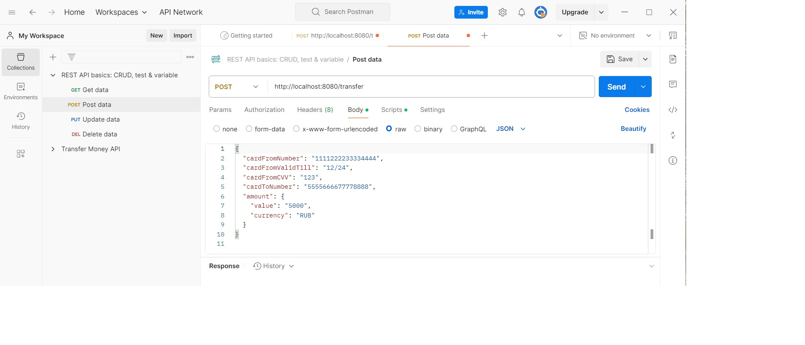
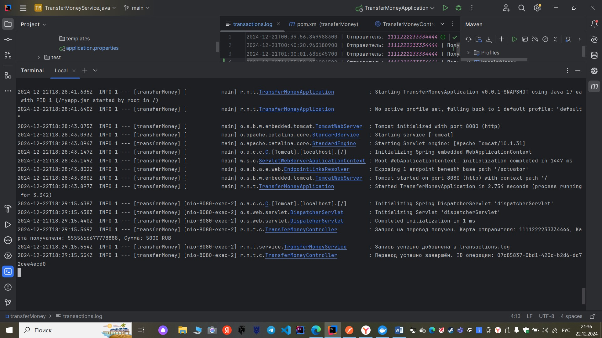

# **Курсовой проект "Сервис перевода денег"**
## Приложение предоставляет простой интерфейс перевода денег с карты на карту.

## **Требования к приложению**
- Сервис должен предоставлять REST-интерфейс для интеграции с FRONT.
- Сервис должен реализовывать все методы перевода с одной банковской карты на другую, описанные [в протоколе](https://github.com/netology-code/jd-homeworks/blob/master/diploma/MoneyTransferServiceSpecification.yaml).
- Все изменения должны записываться в файл — лог переводов в произвольном формате с указанием:
- даты;
- времени;
- карты, с которой было списание;
- карты зачисления;
- суммы;
- комиссии;
- результата операции, если был.

## Требования в реализации

- Приложение разработано с использованием Spring Boot.
- Использован сборщик пакетов gradle/maven.
- Для запуска используется Docker, Docker Compose .
- Код размещён на GitHub.
- Код покрыт юнит-тестами с использованием mockito.
- Добавлены интеграционные тесты с использованием testcontainers.

Шаги реализации:

1. Изучить протокол получения и отправки сообщений.
2. Нарисовать схему приложений.
3. Описать архитектуру приложения, где хранятся настройки, описать формат хранения данных о картах.
4. Создать репозиторий проекта на GitHub.
5. Протестировать приложение с помощью curl/postman.
6. Написать Dockerfile и создать контейнер.
7. Написать Docker Compose  скрипт для запуска FRONT и написанного REST-SERVICE.
8. Протестировать запуск с помощью Docker Compose и интеграцию с FRONT.
9. Написать README.md к проекту, где описать команду запуска, порт и примеры запросов.
10. Отправить на проверку.

## Технологии
- Java 17
- Spring Boot
- Maven
- Docker, Docker Compose
- JUnit 5, Mockito, Testcontainers
- Логирование: SLF4J + Logback


##  Архитектура приложения
###  Основные компоненты
### 1.Контроллеры (Controller):
- Обрабатывают входящие HTTP-запросы и возвращают ответы.
- Класс TransferMoneyController отвечает за обработку запросов /transfer и /confirmOperation.

### 2. Сервисный слой (Service):

- Содержит бизнес-логику приложения.
- Класс TransferMoneyService обрабатывает перевод денег, проверяет валидность карт и баланс, а также записывает операции в лог.

### 3. Репозиторий (Repository):

- Отвечает за работу с данными. Используется stub-репозиторий (CardRepositoryStubImpl), который имитирует хранение данных о картах в памяти.

### 4. Модели (Model):
- Представляют структуру данных, используемых в приложении.
- TransferRequest, TransferResponse, Amount, Card.

### 5. Обработчик ошибок (ExceptionHandler):
- Глобальный обработчик исключений (GlobalExceptionHandler) обрабатывает все ошибки и возвращает понятные клиенту ответы.

## **Запуск приложения:**
### 1. Для запуска REST-сервиса необходимо выполнить сборку проекта в терминале:

```
mvn clean package
```  
### 2. Сборка Docker-образа
```
docker build -t transfer-money-app .
```

### 3. Запуск контейнера
```
docker run -p 8080:8080 transfer-money-app
```
### 4. Запуск с Docker Compose
Либо же можно использовать Docker Compose
```
docker-compose up
```
## Тест с Postman

### Создаем новый запрос.


Нажимаем Send. В результате должны получить:

```
{
  "operationId": "07c85837-0bd1-420c-b2d6-dc72cee4ecd0"
}
```
### Результат в Idea:


